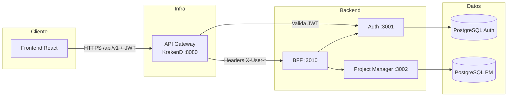
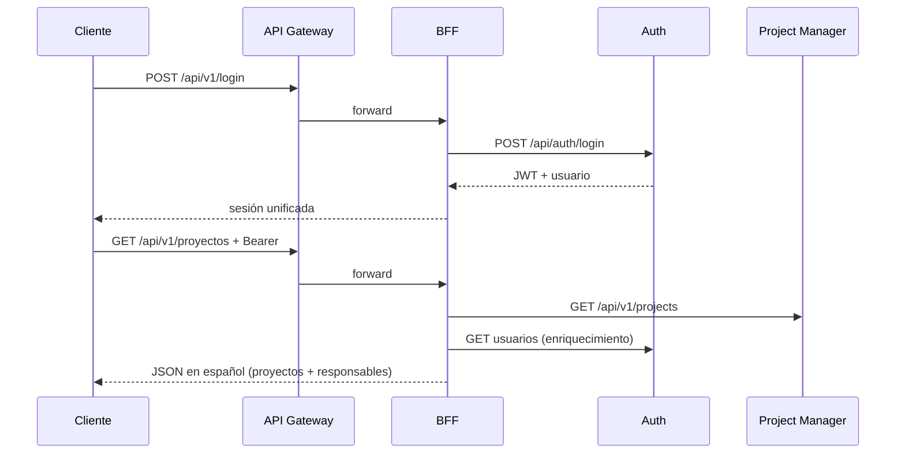
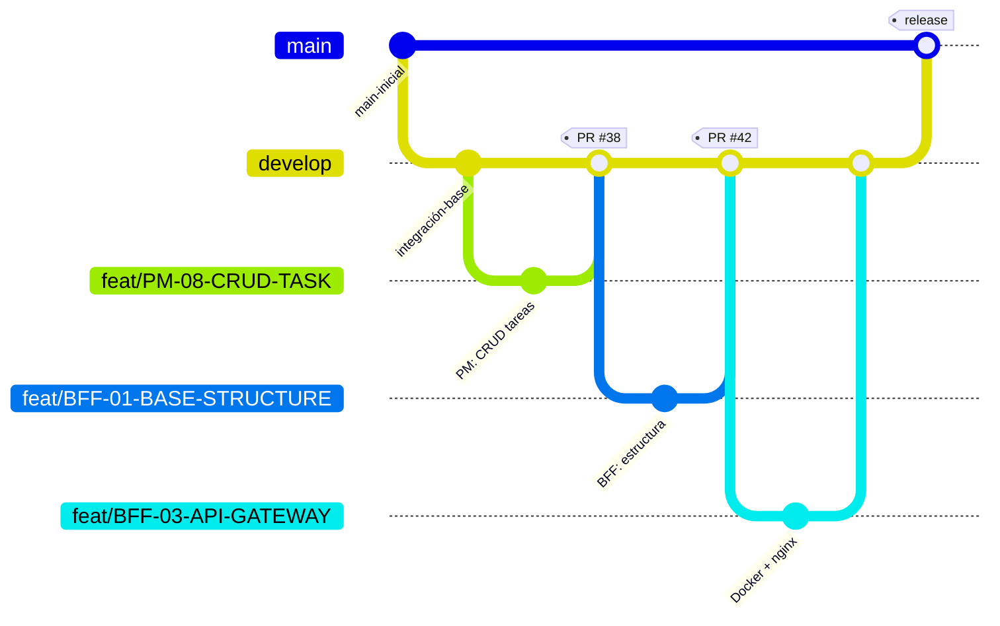

# InnovaTech — Backend

Plataforma backend basada en **microservicios** para gestión de proyectos, tareas y autenticación. El cliente (frontend) se comunica **únicamente** con el **API Gateway (KrakenD)**, que valida JWT y enruta al **BFF**.

---

## Tabla de contenidos

1. [Visión general](#visión-general)
2. [Arquitectura](#arquitectura)
3. [Microservicios](#microservicios)
4. [Patrones y justificación](#patrones-y-justificación)
5. [Estrategia de branching (Git)](#estrategia-de-branching-git)
6. [Testing](#testing)
7. [Inicio rápido](#inicio-rápido)
8. [Despliegue Kubernetes](#despliegue-kubernetes)
9. [Estructura del repositorio](#estructura-del-repositorio)
10. [Documentación de estudio](#documentación-de-estudio)

---

## Visión general

| Aspecto | Detalle |
|--------|---------|
| **Entrada HTTP** | `http://localhost:8010/api/v1/...` |
| **Stack** | Node.js, Express, PostgreSQL (Neon), Docker Compose, KrakenD |
| **Seguridad** | JWT con RSA (RS256) - KrakenD valida tokens, Auth firma con clave privada. Ver [docs/JWT_RSA_MIGRATION.md](../docs/JWT_RSA_MIGRATION.md) |
| **Roles** | `gestor`, `profesional`, `directivo` (RBAC) |

El diseño separa **identidad** (Auth), **dominio de negocio** (Project Manager) y **adaptación al cliente** (BFF), de modo que el frontend no conoce URLs internas ni contratos crudos de cada microservicio. **KrakenD** centraliza autenticación, CORS y rate limiting.

---

## Arquitectura



**Flujo típico (login + listar proyectos):**



---

## Microservicios

| Servicio | Puerto (Docker) | Responsabilidad | Documentación |
|----------|-----------------|-----------------|---------------|
| **API Gateway** | 8010 | Punto único de entrada, proxy a BFF | `api-gateway/nginx.conf` |
| **BFF** | 3010 | Orquestación, roles, contrato front | [README-ESTUDIO](bff/README-ESTUDIO.md) |
| **Auth** | 3001 | Registro, login, JWT, roles, blacklist | [README-ESTUDIO](ms-auth/README-ESTUDIO.md) |
| **Project Manager** | 3002 | Proyectos, tareas, consultas, auditoría | [README-ESTUDIO](ms-project-manager/README-ESTUDIO.md) |

---

## Patrones y justificación

### Arquetipos arquitectónicos

| Arquetipo | Dónde | Por qué |
|-----------|-------|---------|
| **Microservicios** | Auth, PM, BFF | Equipos y despliegues independientes; cada servicio escala y evoluciona según su dominio. |
| **API Gateway** | nginx | Un solo host/puerto para el cliente; oculta topología interna y centraliza TLS/routing en producción. |
| **BFF (Backend for Frontend)** | `bff/` | El front necesita respuestas agregadas y en español; evita acoplar la UI a contratos REST crudos de Auth y PM. |
| **Monolito modular (Auth / PM)** | Capas controller → service → repository | Dominio acotado por servicio sin la complejidad operativa de muchos despliegues internos. |

### Patrones de diseño utilizados

| Patrón | Ubicación | Justificación |
|--------|-----------|---------------|
| **Arquitectura en capas** | BFF (`presentation` / `application` / `infrastructure`) | Separa HTTP, orquestación y clientes HTTP; facilita tests y cambios de upstream sin tocar rutas. |
| **Orquestación** | `*OrchestrationService.js` en BFF | Coordina Auth + PM en una sola petición del front (p. ej. proyectos con nombres de responsables). |
| **Repository** | PM (`projectRepository`, `taskRepository`) | Aísla SQL/PostgreSQL de la lógica de negocio; los servicios no conocen detalles de persistencia. |
| **DTO / Transformer** | PM (`dtos/`), BFF (`frontendResponseTransformers`) | Contrato estable hacia fuera; el BFF traduce inglés → español sin mutar los microservicios internos. |
| **Middleware chain** | Express en los tres servicios | Autenticación JWT, roles, métricas y auditoría de forma composable y reutilizable. |
| **API Gateway (router interno)** | `apiGateway.js` en BFF y PM | Agrupa rutas bajo un prefijo común (`/api/v1`) sin un solo archivo monolítico de rutas. |
| **Circuit Breaker** | Auth, PM (`circuitBreaker.js`, opossum) | Protege llamadas a dependencias (p. ej. Elasticsearch) ante fallos en cascada. |
| **Singleton** | Pools de BD, config | Una instancia de conexión/config por proceso Node. |
| **RBAC** | Auth (emisión `rol`), BFF/PM (`requireRole`) | Autorización declarativa por rol en cada capa que expone datos sensibles. |
| **Errores de dominio** | `errorHandler.js`, `ValidationError`, `UpstreamError` | Respuestas HTTP coherentes y tipado de fallos (validación vs upstream vs no encontrado). |
| **Observabilidad** | Prometheus (`/metrics`), Winston, auditoría Elasticsearch | Métricas y trazabilidad sin mezclar logging con lógica de negocio. |

### Principios que guían el diseño

- **Single responsibility:** cada microservicio tiene un bounded context claro.
- **Fail fast:** validación en BFF/PM antes de llamar a BD o upstream.
- **Contrato único hacia el cliente:** el front solo habla con `/api/v1` vía gateway.
- **Seguridad con RSA:** ms-auth firma tokens con clave privada (RS256), BFF/PM solo verifican con clave pública (no pueden crear tokens).

---

## Estrategia de branching (Git)

Se usa un flujo **Git Flow simplificado**: integración en `develop`, releases en `main`, y ramas de feature por tarea o módulo.

### Ramas principales

| Rama | Propósito |
|------|-----------|
| `main` | Código estable / entregable |
| `develop` | Integración continua de features |
| `feat/*` | Desarrollo por historia (BFF, PM, Auth, front) |
| `feature/*` | Variante de nomenclatura para Auth (`feature/AS-TASK-XX`) |

### Convención de nombres (ejemplos reales del repo)

```
feat/BFF-01-BASE-STRUCTURE
feat/BFF-05-ENDPOINTS-ROUTES
feat/PM-08-CRUD-TASK
feat/PM-13-STATE-TRANSITION-VALIDATION
feature/AS-TASK-01-estructura-auth
```

### Flujo de trabajo



### Comandos útiles

```bash
# Ver historial visual
git log --oneline --graph --all -30

# Crear feature desde develop
git checkout develop
git pull origin develop
git checkout -b feat/PM-15-mi-feature

# Integrar vía Pull Request hacia develop (recomendado)
# Luego merge periódico develop → main en releases
```

**Regla práctica:** una rama `feat/*` por historia; commits descriptivos (`PM Task-14: …`, `BFF Task-05: …`); no mezclar BFF y PM en la misima rama salvo integración explícita.

---

## Testing

Estrategia **Jest + Supertest** en los tres microservicios, con **umbral global de cobertura del 50%** (statements, branches, functions, lines).

| Servicio | Herramienta | Ubicación | Qué se prueba |
|----------|-------------|-----------|---------------|
| **Auth** | Jest + Supertest | `ms-auth/tests/` | JWT RS256, bcrypt, roles, DTOs, circuit breaker, integración HTTP (JWKS, register/login) |
| **Project Manager** | Jest + Supertest | `ms-project-manager/tests/` | Servicios, validación, DTOs, middleware, integración HTTP con JWT |
| **BFF** | Jest + Supertest | `bff/tests/` | Orquestación auth, upstream mock, rutas protegidas, `/health` |

### Ejecutar tests

```bash
# Los tres microservicios (desde backend/)
npm test

# Por servicio
cd ms-auth && npm test
cd ms-project-manager && npm test
cd bff && npm test

# CI (sin watch, falla si cobertura < 50%)
npm run test:ci
```

### Filosofía

- **Sin Postgres real:** `tests/setup.js` en Auth y PM mockea BD / dependencias; Supertest ejercita la app Express sin `listen`.
- **Integración HTTP:** BFF y PM validan headers KrakenD/JWT; Auth expone JWKS y flujos básicos de auth.
- **Legacy:** `metrics.test.js` y `http-validation.test.js` en Auth quedan excluidos del runner (requieren BD y métricas completas).
- **CI recomendado:** `npm run test:ci` en cada PR hacia `develop`.

---

## Inicio rápido

### Requisitos

- Node.js 20+
- Docker Desktop
- URLs PostgreSQL (Neon u otro) para Auth y PM

### Docker Compose (recomendado)

```bash
cd backend
cp .env.docker.example .env.docker
# Editar DATABASE_URL_AUTH y DATABASE_URL_PM

# 1. Generar claves RSA para JWT (solo la primera vez)
cd ms-auth && node scripts/generate-keys.js && cd ..

# 2. Configurar bases de datos
cp .env.docker.example .env.docker
# Editar DATABASE_URL_AUTH, DATABASE_URL_PM

# 3. Iniciar servicios con KrakenD
docker compose --env-file .env.docker up --build
```

**Nota:** Ya **NO** es necesario copiar `public.key` al BFF ni a ms-project-manager. KrakenD valida JWT centralizadamente consultando el endpoint JWKS de ms-auth.

| Endpoint | URL |
|----------|-----|
| API (KrakenD) | http://localhost:8010/api/v1/ |
| JWKS (clave pública) | http://localhost:8010/.well-known/jwks.json |
| Health BFF | http://localhost:8010/health |

### Desarrollo local (servicio a servicio)

Ver cada [README-ESTUDIO](#documentación-de-estudio) para puertos, variables y migraciones.

---

## Despliegue Kubernetes

Manifiestos en la carpeta `k8s/` de cada servicio; despliegue unificado desde [`k8s/`](k8s/README.md).

```bash
# Construir imágenes
docker build -t innovatech/ms-auth:latest ./ms-auth
docker build -t innovatech/ms-project-manager:latest ./ms-project-manager
docker build -t innovatech/bff:latest ./bff

# Secrets + stack
kubectl apply -f k8s/namespace.yaml
# (crear innovatech-db-secrets y auth-jwt-keys — ver k8s/README.md)
kubectl apply -k .
```

| Recurso | Ubicación |
|---------|-----------|
| Guía general K8s | [k8s/README.md](k8s/README.md) |
| API Gateway | [api-gateway/k8s/](api-gateway/k8s/) |
| BFF | [bff/k8s/](bff/k8s/) |
| Auth | [ms-auth/k8s/](ms-auth/k8s/) |
| Project Manager | [ms-project-manager/k8s/](ms-project-manager/k8s/) |

Entrada HTTP: `http://localhost:8010/api/v1/…` (LoadBalancer o `kubectl port-forward`).

---

## Estructura del repositorio

```
backend_innovatech/
├── backend/                     ← microservicios + gateway + compose
│   ├── README.md
│   ├── docker-compose.yml
│   ├── k8s/                     ← namespace, kustomization, secrets
│   ├── .env.docker
│   ├── api-gateway/
│   │   ├── krakend.json         ← Config KrakenD (Docker Compose)
│   │   └── k8s/                 ← KrakenD + krakend.json (K8s)
│   ├── bff/k8s/
│   ├── ms-auth/k8s/
│   └── ms-project-manager/k8s/
└── frontend/                    ← cliente React (Vite)
```

---

## Documentación de estudio

Guías orientadas a **entender y presentar** cada componente:

| Microservicio | Guía |
|---------------|------|
| Auth | [ms-auth/README-ESTUDIO.md](ms-auth/README-ESTUDIO.md) |
| BFF | [bff/README-ESTUDIO.md](bff/README-ESTUDIO.md) |
| Project Manager | [ms-project-manager/README-ESTUDIO.md](ms-project-manager/README-ESTUDIO.md) |

Documentación operativa detallada de Auth: [ms-auth/README.md](ms-auth/README.md).

---

## Licencia

MIT © InnovaTech
