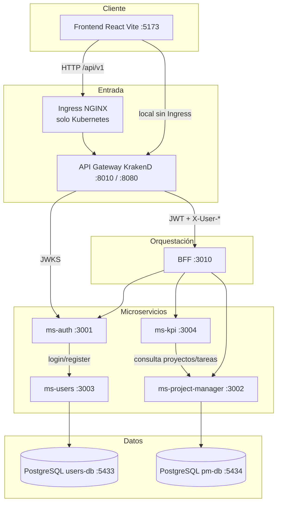
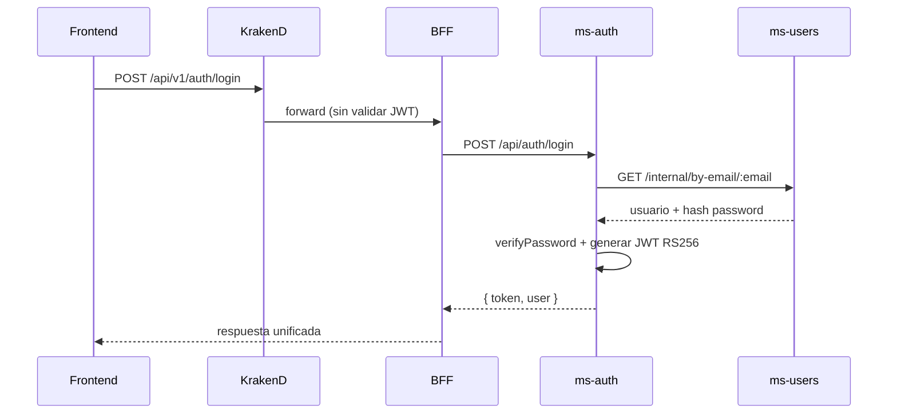
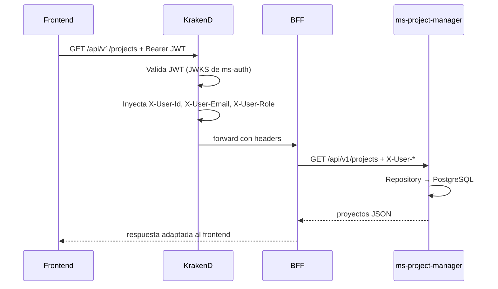

# InnovaTech — Backend

Plataforma backend basada en **microservicios** para autenticación, gestión de usuarios y administración de proyectos/tareas. El frontend se comunica **únicamente** con el **API Gateway (KrakenD)** en `/api/v1`. KrakenD valida JWT, aplica roles y reenvía al **BFF**, que orquesta las llamadas internas.

> **Guía central del proyecto:** [docs/README.md](../docs/README.md) · **Inicio rápido:** [docs/INSTRUCCIONES-INICIO.md](../docs/INSTRUCCIONES-INICIO.md)

---

## Tabla de contenidos

1. [Visión general](#visión-general)
2. [Arquitectura y flujo de peticiones](#arquitectura-y-flujo-de-peticiones)
3. [Microservicios](#microservicios)
4. [Seguridad (JWT RS256)](#seguridad-jwt-rs256)
5. [Patrones de diseño](#patrones-de-diseño)
6. [Inicio rápido (Docker Compose)](#inicio-rápido-docker-compose)
7. [Despliegue Kubernetes e Ingress](#despliegue-kubernetes-e-ingress)
8. [Testing](#testing)
9. [Estructura del repositorio](#estructura-del-repositorio)
10. [Documentación adicional](#documentación-adicional)
11. [Matriz de requerimientos (evaluación)](#matriz-de-requerimientos-evaluación)

---

## Visión general

| Aspecto | Detalle |
|--------|---------|
| **Entrada HTTP (local)** | `http://localhost:8010/api/v1/...` |
| **Entrada HTTP (K8s)** | `http://api.innovatech.local/api/v1/...` (vía Ingress NGINX) |
| **Stack** | Node.js 20+, TypeScript, Express, PostgreSQL, Docker Compose, KrakenD 2.7 |
| **Autenticación** | JWT **RS256** — `ms-auth` firma con clave privada; KrakenD verifica vía JWKS |
| **Roles (RBAC)** | `gestor`, `profesional`, `directivo` |
| **Bases de datos** | **Database per Service**: `users-db` (ms-users) y `pm-db` (project-manager) |

### Decisiones clave de diseño

- **Database per Service:** cada microservicio tiene su propia base PostgreSQL. Los datos de usuarios viven en `ms-users`, no en `ms-auth`.
- **API Gateway centralizado:** KrakenD concentra CORS, validación JWT, control de roles y propagación de identidad (`X-User-*`).
- **BFF como orquestador:** adapta respuestas al frontend (español, agregación) sin duplicar lógica de dominio.
- **Comunicación interna:** `ms-auth` llama a `ms-users` por HTTP con token interno (`X-Internal-Token`) para login/registro.

---

## Arquitectura y flujo de peticiones

### Diagrama general



### Local vs Kubernetes

| Capa | Docker Compose | Kubernetes |
|------|----------------|--------------|
| Puerta de entrada | Puerto `8010` expuesto por KrakenD | **Ingress NGINX** → Service `api-gateway:8080` |
| DNS interno | Nombres de servicio Docker (`bff`, `auth`, `users`…) | DNS del cluster (`bff`, `ms-auth`, `ms-users`…) |
| Bases de datos | Contenedores `users-db` y `pm-db` | URLs en Secrets (Neon, RDS, etc.) |

En local **no hay Ingress**: KrakenD cumple el rol de punto único de entrada. En K8s, el **Ingress** abre el cluster hacia fuera y delega en KrakenD.

### Flujo: login (ruta pública)



### Flujo: listar proyectos (ruta protegida)



---

## Microservicios

| Servicio | Puerto (Docker) | Responsabilidad | Capas principales |
|----------|-----------------|-----------------|-------------------|
| **API Gateway** | 8010 → 8080 | Entrada única, JWT, CORS, roles | `api-gateway/krakend.json` |
| **BFF** | 3010 (interno) | Orquestación hacia auth y PM | `presentation` → `application` → `infrastructure` |
| **ms-auth** | 3001 (interno) | Login, logout, registro, JWT, blacklist, JWKS | Controller → **AuthService** → usersClient |
| **ms-users** | 3003 (interno) | CRUD usuarios, endpoints internos para auth | Controller → **UserService** → **UserRepository** |
| **ms-project-manager** | 3002 (interno) | Proyectos, tareas, colaboración, consultas | Controller → Service → **Repository** |
| **ms-kpi** | 3004 (interno) | KPIs y dashboard de progreso (agrega datos de PM) | Controller → **KpiService** → projectManagerClient |

### Endpoints de referencia (vía KrakenD)

| Acción | Método | Ruta pública |
|--------|--------|--------------|
| Login | POST | `/api/v1/auth/login` |
| Registro | POST | `/api/v1/auth/register` |
| Logout | POST | `/api/v1/auth/logout` |
| Listar proyectos | GET | `/api/v1/projects` |
| Crear proyecto | POST | `/api/v1/projects` |
| Tareas de un proyecto | GET | `/api/v1/projects/{id}/tasks` |
| Cambiar estado tarea | PATCH | `/api/v1/projects/{id}/tasks/{taskId}/status` |
| Dashboard KPIs | GET | `/api/v1/kpis/dashboard` |
| Consultas KPI (legacy PM) | GET | `/api/v1/consultations/kpis` |
| JWKS (clave pública) | GET | `/.well-known/jwks.json` |

### Usuarios de prueba (seed local)

Contraseña para todos: **`Secret123`**

| Email | Rol |
|-------|-----|
| `gestor@innovatech.cl` | gestor (dueño de proyectos demo) |
| `profesional@innovatech.cl` | profesional |
| `directivo@innovatech.cl` | directivo |

---

## Seguridad (JWT RS256)

```
ms-auth (private.key)  →  FIRMA tokens JWT
KrakenD                →  VALIDA tokens consultando http://auth:3001/.well-known/jwks.json
BFF / ms-project-manager →  Reciben identidad vía headers X-User-* (propagados por KrakenD)
                         →  Fallback: verifican Bearer con public.key (desarrollo / port-forward)
```

**Propagación de claims en KrakenD** (`propagate_claims`):

| Claim JWT | Header HTTP |
|-----------|-------------|
| `id` | `X-User-Id` |
| `email` | `X-User-Email` |
| `rol` | `X-User-Role` |

Rutas sensibles (p. ej. crear proyecto) exigen rol `gestor` o `directivo` directamente en la configuración de KrakenD.

---

## Patrones de diseño

Refactor aplicado para mantener código legible y responsabilidades claras:

| Patrón | Dónde | Qué hace |
|--------|-------|----------|
| **API Gateway** | KrakenD | Punto único de entrada, seguridad y routing |
| **BFF** | `bff/` | Orquestación y contrato orientado al frontend |
| **Database per Service** | `ms-users`, `ms-project-manager` | BD independiente por dominio |
| **Repository** | `ms-users`, `ms-project-manager` | SQL aislado en `*Repository.ts` |
| **Service layer** | Todos los MS | Lógica de negocio, validación de reglas, orquestación interna |
| **DTO + validación custom** | `*/dtos/` | Limpieza de input y validaciones esenciales (sin Joi/Zod) |
| **Controller delgado** | Todos los MS | Solo HTTP: delegar al service, mapear errores, métricas |
| **RBAC** | KrakenD + middlewares | Roles en gateway y en servicios internos |
| **Circuit Breaker** | ms-auth, ms-project-manager | Protección ante fallos de dependencias (Opossum) |

### Regla de validación (una sola fuente)

```
Request → DTO (limpiar + validar lo esencial) → Service (reglas de negocio) → Repository (SQL)
                ↑
         El controller NO duplica validaciones
```

**Ejemplos concretos del refactor:**

- **ms-auth:** `AuthService` concentra register/login/logout; `user.service` solo verifica passwords.
- **ms-users:** `UserRepository` concentra SQL; `UserService` valida vía DTO y aplica reglas (email duplicado, bcrypt).
- **ms-project-manager:** validación movida de controllers a `*FromRequest()` en services.

---

## Inicio rápido (Docker Compose)

### Requisitos

- Node.js 20+
- Docker Desktop
- Git

### Pasos

```bash
cd backend

# 1. Claves RSA (primera vez)
cd ms-auth && node scripts/generate-keys.js && cd ..

# 2. Variables de entorno (opcional si usas Postgres local del compose)
cp .env.docker.example .env.docker

# 3. Levantar stack completo
docker compose --env-file .env.docker up -d --build
```

### Verificar servicios

| Recurso | URL |
|---------|-----|
| API (KrakenD) | http://localhost:8010/api/v1/ |
| JWKS | http://localhost:8010/.well-known/jwks.json |
| PostgreSQL users | `localhost:5433` (db: `innovatech_users`) |
| PostgreSQL PM | `localhost:5434` (db: `innovatech_pm`) |

### Frontend (opcional)

```bash
cd ../frontend
npm install
npm run dev
# http://localhost:5173 — apunta a VITE_API_BASE_URL=/api/v1 o http://localhost:8010/api/v1
```

### Comandos útiles

```bash
# Ver logs
docker compose logs -f api-gateway bff auth users project-manager

# Reconstruir un servicio
docker compose up -d --build auth

# Parar todo
docker compose down
```

---

## Despliegue Kubernetes e Ingress

Manifiestos en `k8s/` (namespace, **Ingress**, kustomization) y en cada servicio (`*/k8s/`).

### Ingress

El archivo `k8s/ingress.yaml` expone el API Gateway al exterior:

```yaml
# host: api.innovatech.local → service: api-gateway:8080
# ingressClassName: nginx
```

Requisito: tener un **NGINX Ingress Controller** en el cluster (minikube, Rancher Desktop, AKS, etc.).

### Desplegar

```bash
cd backend

# Claves JWT
kubectl create secret generic innovatech-jwt-keys -n innovatech \
  --from-file=private.key=ms-auth/keys/private.key \
  --from-file=public.key=ms-auth/keys/public.key

# Secretos de BD (copiar secrets.example.yaml → secrets.yaml)
kubectl apply -f k8s/secrets.yaml

# Stack completo
kubectl apply -k k8s/
kubectl get pods,svc,ingress -n innovatech
```

### Acceso sin Ingress (desarrollo)

```bash
kubectl port-forward -n innovatech svc/api-gateway 8010:8080
# API: http://localhost:8010/api/v1/...
```

| Servicio K8s | Puerto | Acceso |
|--------------|--------|--------|
| `api-gateway` | 8080 | Público (Ingress / port-forward) |
| `bff` | 3010 | Solo interno (ClusterIP) |
| `ms-auth` | 3001 | Solo interno |
| `ms-users` | 3003 | Solo interno |
| `ms-project-manager` | 3002 | Solo interno |
| `ms-kpi` | 3004 | Solo interno |

Guía detallada: [k8s/README.md](k8s/README.md)

---

## Testing

Estrategia **Jest + Supertest** (ESM en ms-auth, ms-users, ms-project-manager y BFF). Umbral de cobertura **≥ 60%** (rúbrica EP3).

```bash
cd backend

# Todos los microservicios + BFF
npm test

# Por servicio
cd ms-auth && npm test
cd ms-users && npm test
cd ms-project-manager && npm test
cd ms-kpi && npm test
cd bff && npm test

# CI
npm run test:ci

# Smoke E2E (stack Docker levantado)
npm run smoke
```

| Servicio | Qué se prueba |
|----------|---------------|
| **ms-auth** | DTOs, JWT RS256, bcrypt, roles, JWKS, login/register (mock de ms-users) |
| **ms-users** | CRUD, DTOs, repository, roles, endpoints internos |
| **ms-project-manager** | Servicios, validación, transiciones de estado, middleware |
| **ms-kpi** | Agregación de KPIs, dashboard, cliente upstream a PM |
| **BFF** | Orquestación, upstream mock, rutas protegidas, KPIs |

**Notas:**

- Los tests de integración **no requieren PostgreSQL real** (mocks en `tests/setup.*`).
- `ms-auth` usa mock de `usersClient` para simular ms-users en ESM (`tests/mocks/usersClient.js`).
- La app no abre puerto en modo test (`NODE_ENV=test`).
- Frontend: `cd ../frontend && npm run test:coverage` (Vitest).

---

## Estructura del repositorio

```
backend/
├── README.md                    ← este documento
├── docker-compose.yml           ← stack local completo
├── package.json                 ← npm test, smoke, k8s:dev
├── kustomization.yaml           ← despliegue K8s completo (Flyway + servicios)
├── scripts/                     ← smoke-e2e, k8s-dev-up, utilidades ESM
├── .env.docker.example
├── api-gateway/
│   ├── krakend.json             ← rutas, JWT, CORS, roles
│   └── k8s/
├── bff/
│   ├── src/
│   │   ├── presentation/        ← controllers, middlewares, routes
│   │   ├── application/         ← orchestration services (auth, PM, KPI)
│   │   └── infrastructure/      ← HTTP clients upstream
│   └── k8s/
├── ms-auth/
│   ├── src/
│   │   ├── controllers/         ← delgados (HTTP only)
│   │   ├── services/            ← auth.service, user.service
│   │   ├── dtos/
│   │   └── clients/             ← usersClient → ms-users
│   └── k8s/
├── ms-users/
│   ├── src/
│   │   ├── controllers/
│   │   ├── services/
│   │   ├── repositories/        ← userRepository.ts
│   │   └── dtos/
│   ├── db/flyway/               ← migraciones SQL
│   └── k8s/
├── ms-project-manager/
│   ├── src/
│   │   ├── controllers/         ← delgados
│   │   ├── services/            ← validación + negocio
│   │   ├── repositories/
│   │   └── dtos/
│   ├── db/flyway/
│   └── k8s/
├── ms-kpi/
│   ├── src/                     ← KPIs y dashboard (consulta PM)
│   └── k8s/
└── k8s/
    ├── namespace.yaml
    ├── ingress.yaml             ← Ingress NGINX
    ├── postgres/                ← BD in-cluster + jobs Flyway
    └── kustomization.yaml
```

---

## Documentación adicional

| Tema | Ubicación |
|------|-----------|
| Guía central EP3 | [docs/README.md](../docs/README.md) |
| Inicio rápido | [docs/INSTRUCCIONES-INICIO.md](../docs/INSTRUCCIONES-INICIO.md) |
| Despliegue K8s | [k8s/README.md](k8s/README.md) |
| Auth (operativo) | [ms-auth/README.md](ms-auth/README.md) |
| ms-users | [ms-users/README.md](ms-users/README.md) |
| ms-kpi | [ms-kpi/README.md](ms-kpi/README.md) |
| BFF / Gateway / PM | [bff/README.md](bff/README.md), [api-gateway/README.md](api-gateway/README.md), [ms-project-manager/README.md](ms-project-manager/README.md) |
| Guías de estudio | `*/README-ESTUDIO.md` |
| Frontend | [frontend/README.md](../frontend/README.md) |

---

## Licencia

MIT © InnovaTech
