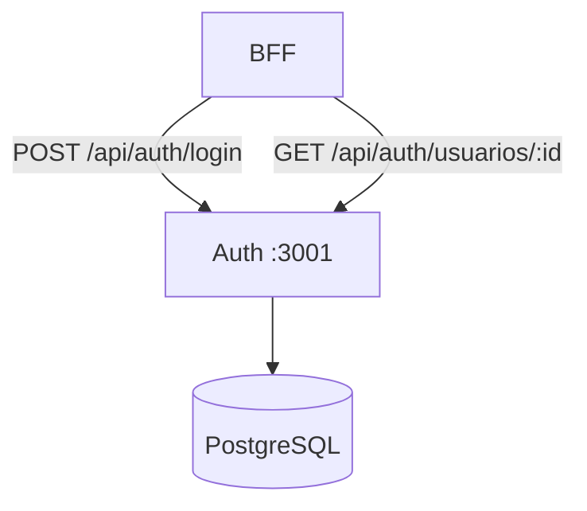
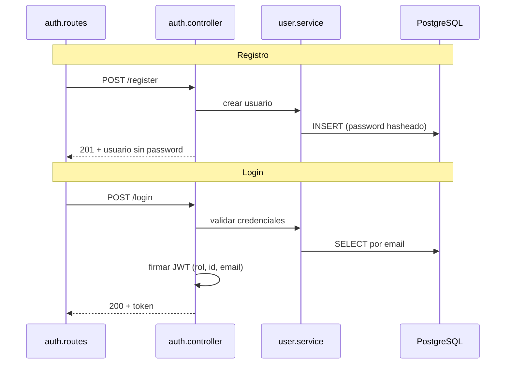

# Auth — Guía de estudio

Microservicio de **identidad y acceso**: registro, autenticación JWT, roles (RBAC), logout con blacklist de tokens y métricas Prometheus.

> Documentación operativa completa: [README.md](./README.md)

---

## Objetivos de aprendizaje

Al terminar esta guía deberías poder explicar:

1. Cómo se registra un usuario y cómo se persiste el hash de contraseña.
2. Qué contiene el JWT y cómo lo validan BFF y PM.
3. Cómo funcionan los tres roles y dónde se validan.
4. Qué ocurre en logout (blacklist).
5. Qué tests cubren el servicio.

---

## Posición en el sistema



El **frontend no llama a Auth directamente** en producción; el BFF reenvía u orquesta. Auth sigue siendo la **fuente de verdad** de usuarios y tokens.

---

## Arquetipo y patrones

| Concepto | Implementación |
|----------|----------------|
| **Microservicio de dominio acotado** | Solo autenticación/autorización de identidad |
| **Capas** | Routes → Controllers → Services → DB |
| **RBAC** | Roles `gestor`, `profesional`, `directivo` en BD y JWT (`rol`) |
| **Stateless auth** | JWT firmado con `JWT_SECRET` |
| **Circuit Breaker** | Llamadas resilientes (p. ej. auditoría externa) |
| **Observabilidad** | Winston + `/metrics` (Prometheus) |

---

## Flujo: registro y login



---

## API principal

Prefijo: **`/api/auth`**

| Método | Ruta | Auth | Descripción |
|--------|------|------|-------------|
| POST | `/register` | No | Alta de usuario con `rol` |
| POST | `/login` | No | Devuelve JWT |
| POST | `/logout` | Bearer | Invalida token (blacklist) |
| GET | `/roles` | No | Catálogo de roles |
| PUT | `/usuarios/:id/rol` | Bearer + rol | Cambio de rol |
| GET | `/usuarios/:id` | Bearer | Perfil (usado por BFF) |
| GET | `/metrics` | No | Prometheus |
| GET | `/health` | No | Health check |

**Roles válidos:** `gestor` | `profesional` | `directivo`

---

## Estructura de carpetas (orden de lectura)

```
ms-auth/src/
├── app.js                      # Montaje Express
├── config/
│   ├── database.js             # Pool PostgreSQL
│   └── roles.js                # Constantes de roles
├── controllers/
│   └── auth.controller.js      # Orquestación HTTP
├── services/
│   ├── user.service.js         # Lógica de usuarios
│   └── token.blacklist.service.js
├── middleware/
│   ├── auth.middleware.js      # Verificar JWT
│   └── checkRole.js            # RBAC en rutas
├── routes/
│   └── auth.routes.js
└── utils/
    ├── jwt.helper.js
    └── logger.js
```

**Ruta sugerida de estudio:** `auth.routes.js` → `auth.controller.js` → `user.service.js` → `jwt.helper.js` → `auth.middleware.js`.

---

## Variables de entorno clave

| Variable | Uso |
|----------|-----|
| `PORT` | Puerto (3001) |
| `DATABASE_URL` | PostgreSQL |
| `JWT_SECRET` | **Debe coincidir** con BFF y PM |
| `JWT_EXPIRES_IN` | Expiración del token |
| `BCRYPT_SALT_ROUNDS` | Coste del hash |

---

## Testing

```bash
cd ms-auth
npm test              # Jest + cobertura (ver jest.config.js)
npm test -- --watch
```

| Archivo | Enfoque |
|---------|---------|
| `tests/auth.test.js` | Flujos de autenticación |
| `tests/jwt.test.js` | Firma y verificación |
| `tests/bcrypt.test.js` | Hash de contraseñas |
| `tests/roles.test.js` | RBAC |
| `tests/http-validation.test.js` | Contrato JSON |
| `tests/metrics.test.js` | Endpoint `/metrics` |

Los tests de integración pueden requerir **BD configurada** en `.env`. Para estudio, empieza por `jwt.test.js` y `bcrypt.test.js` (sin dependencias externas).

---

## Preguntas para autoevaluación

1. ¿Por qué el JWT incluye `rol` y no solo `sub`?
2. ¿Qué pasa si `JWT_SECRET` difiere entre Auth y BFF?
3. ¿Dónde se evita guardar la contraseña en texto plano?
4. ¿Cómo invalida logout un token aún no expirado?

---

## Referencias cruzadas

- [README backend](../../README.md) — arquitectura global y Git Flow
- [BFF README-ESTUDIO](../bff/README-ESTUDIO.md) — orquestación de login
- [PM README-ESTUDIO](../ms-project-manager/README-ESTUDIO.md) — validación del mismo JWT
