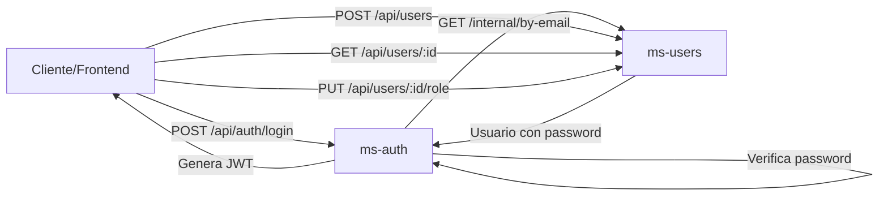

# 🔄 Refactorización Completada: ms-auth → ms-users

## 📋 Resumen de Cambios

Se ha completado la **separación de responsabilidades** entre:
- **ms-auth**: Solo autenticación (login, logout, tokens, roles)
- **ms-users**: Gestión completa de usuarios (CRUD, roles de usuarios)

Esta refactorización sigue los principios **SOLID** (Single Responsibility Principle).

---

## ✅ Cambios Realizados en ms-auth

### 1. **Endpoints Eliminados** ❌

Los siguientes endpoints ya **NO existen** en ms-auth:

| Endpoint Antiguo (ms-auth) | Nuevo Endpoint (ms-users) | Método |
|----------------------------|---------------------------|--------|
| `POST /api/auth/register` | `POST /api/users` | Crear usuario |
| `GET /api/auth/usuarios/:id` | `GET /api/users/:id` | Obtener usuario |
| `PUT /api/auth/usuarios/:id/rol` | `PUT /api/users/:id/role` | Cambiar rol |

### 2. **Endpoints Mantenidos** ✅

ms-auth **solo** maneja autenticación:

| Endpoint | Método | Descripción |
|----------|--------|-------------|
| `/api/auth/login` | POST | Autenticar y generar token |
| `/api/auth/logout` | POST | Invalidar token |
| `/api/auth/roles` | GET | Listar roles disponibles |
| `/api/auth/roles/simple` | GET | Roles simplificados |
| `/.well-known/jwks.json` | GET | Claves públicas JWT |
| `/health` | GET | Health check |

### 3. **Refactorización de /login** 🔧

**Antes:**
```javascript
// ms-auth consultaba su propia base de datos
const user = await userService.findByEmail(email);
```

**Ahora:**
```javascript
// ms-auth llama a ms-users para obtener datos del usuario
const user = await usersClient.findByEmailWithPassword(email);
```

**Flujo de Login Actualizado:**
1. Usuario envía credenciales a `POST /api/auth/login`
2. ms-auth llama internamente a ms-users: `GET /api/users/internal/by-email/:email`
3. ms-users retorna usuario con password (solo para verificación interna)
4. ms-auth verifica password con bcrypt
5. ms-auth genera token JWT y lo retorna

### 4. **Cliente HTTP para ms-users** 🌐

Archivo: `backend/ms-auth/src/clients/usersClient.ts`

```javascript
// Llama a ms-users para obtener datos de usuario
const user = await usersClient.findByEmailWithPassword(email);
```

**Seguridad:**
- Usa token interno `INTERNAL_SERVICE_TOKEN` para autenticar llamadas entre servicios
- Solo ms-auth puede llamar a endpoints internos de ms-users

---

## ✅ Cambios Realizados en ms-users

### 1. **Endpoints Internos Agregados** 🔒

Los siguientes endpoints **solo** pueden ser llamados por otros microservicios (ms-auth, bff):

| Endpoint | Método | Uso |
|----------|--------|-----|
| `/api/users/internal/by-email/:email` | GET | Buscar usuario por email (incluye password) |
| `/api/users/internal` | POST | Crear usuario desde otro servicio |

**Seguridad:**
- Requieren header `X-Internal-Service: ms-auth`
- Requieren header `X-Internal-Token: <token>`
- Validados por middleware `validateInternalToken`

### 2. **Middleware de Seguridad Interna**

Archivo: `backend/ms-users/src/middleware/internal.middleware.ts`

```javascript
// Solo permite llamadas de ms-auth y bff
const allowedServices = ['ms-auth', 'bff'];
```

**Protección:**
- Valida que el token interno sea correcto
- Valida que el servicio esté en la lista blanca
- Registra todas las llamadas internas en logs

### 3. **Rutas Actualizadas**

Archivo: `backend/ms-users/src/app.ts`

```javascript
// Rutas públicas (requieren JWT del usuario)
app.use('/api/users', userRoutes);

// Rutas internas (requieren token de servicio)
app.use('/api/users/internal', internalRoutes);
```

---

## 🔧 Variables de Entorno Nuevas

### backend/.env.docker

```bash
# Comunicación entre microservicios
USERS_SERVICE_URL=http://users:3003
INTERNAL_SERVICE_TOKEN=development-token-change-in-production
```

⚠️ **IMPORTANTE EN PRODUCCIÓN:**
- Cambiar `INTERNAL_SERVICE_TOKEN` por un token seguro y aleatorio
- Usar variables de entorno secretas (no hardcodeadas)
- Considerar autenticación mutua TLS (mTLS) entre servicios

---

## 🐳 Cambios en docker-compose.yml

### Servicio ms-auth

```yaml
auth:
  environment:
    # Nueva: URL del microservicio de usuarios
    USERS_SERVICE_URL: ${USERS_SERVICE_URL:-http://users:3003}
    # Nueva: Token de seguridad interno
    INTERNAL_SERVICE_TOKEN: ${INTERNAL_SERVICE_TOKEN:-development-token}
  depends_on:
    - users  # Nuevo: ms-auth depende de ms-users
```

### Servicio ms-users

```yaml
users:
  environment:
    # Nueva: Token de seguridad interno
    INTERNAL_SERVICE_TOKEN: ${INTERNAL_SERVICE_TOKEN:-development-token}
```

---

## 📊 Diagrama de Flujo Actualizado



---

## 🧪 Testing

### Probar Login (ms-auth llama a ms-users)

```bash
# 1. Crear usuario en ms-users
curl -X POST http://localhost:3003/api/users \
  -H "Content-Type: application/json" \
  -d '{
    "nombre": "Test User",
    "email": "test@example.com",
    "password": "Password123!",
    "rol": "gestor"
  }'

# 2. Login en ms-auth (llama internamente a ms-users)
curl -X POST http://localhost:3001/api/auth/login \
  -H "Content-Type: application/json" \
  -d '{
    "email": "test@example.com",
    "password": "Password123!"
  }'
```

### Probar Endpoint Interno (requiere token interno)

```bash
# Llamada interna de ms-auth a ms-users
curl -X GET "http://localhost:3003/api/users/internal/by-email/test@example.com" \
  -H "X-Internal-Service: ms-auth" \
  -H "X-Internal-Token: development-token"
```

---

## 📝 Logs y Auditoría

Todos los cambios mantienen el logging existente:

### ms-auth
```javascript
logger.info('[AUTH-AUDIT] Login exitoso - Usuario obtenido desde ms-users');
```

### ms-users
```javascript
logger.info('[INTERNAL-CONTROLLER] Usuario encontrado - Servicio: ms-auth');
```

---

## 🚀 Deployment

### Orden de Inicio

1. **ms-users** debe iniciar primero
2. **ms-auth** depende de ms-users (configurado en docker-compose)

```bash
# Iniciar todos los servicios
docker compose --env-file .env.docker up --build

# Verificar que ms-users esté ready antes de ms-auth
docker compose logs users
docker compose logs auth
```

---

## ✅ Checklist de Migración

- [x] Eliminar endpoints de usuarios en ms-auth
- [x] Crear cliente HTTP en ms-auth para llamar a ms-users
- [x] Refactorizar /login para usar usersClient
- [x] Crear endpoints internos en ms-users
- [x] Agregar middleware de seguridad interna
- [x] Actualizar variables de entorno
- [x] Actualizar docker-compose.yml con dependencias
- [x] Comentar código deprecado (no eliminado, por referencia)
- [ ] Actualizar BFF para llamar a ms-users (pendiente)
- [ ] Actualizar Frontend para usar endpoints de ms-users (pendiente)
- [ ] Actualizar KrakenD gateway con nuevas rutas (pendiente)

---

## 📚 Documentos Relacionados

- [MIGRACION_AUTH_USERS.md](../ms-users/docs/MIGRACION_AUTH_USERS.md) - Guía de migración original
- [README-SEPARACION.md](../ms-users/docs/README-SEPARACION.md) - Explicación de la separación
- [ms-users/README.md](../ms-users/README.md) - Documentación completa de ms-users

---

## 🎯 Próximos Pasos

1. **Actualizar BFF** para llamar a ms-users en lugar de ms-auth
2. **Actualizar Frontend** para usar los nuevos endpoints de ms-users
3. **Configurar KrakenD** con las nuevas rutas
4. **Testing completo** de integración end-to-end
5. **Deployment a producción** con variables de entorno seguras

---

## 🔍 Troubleshooting

### Error: "Usuario no encontrado" en login

**Causa:** ms-users no está disponible o no responde

**Solución:**
```bash
# Verificar que ms-users esté corriendo
docker compose ps users

# Ver logs de ms-users
docker compose logs users
```

### Error: "Token de servicio interno inválido"

**Causa:** `INTERNAL_SERVICE_TOKEN` no coincide entre servicios

**Solución:**
```bash
# Verificar variables de entorno
docker compose config | grep INTERNAL_SERVICE_TOKEN

# Rebuild con variables correctas
docker compose --env-file .env.docker up --build
```

---

**Fecha de Refactorización:** 2026-06-05  
**Estado:** ✅ Completado
