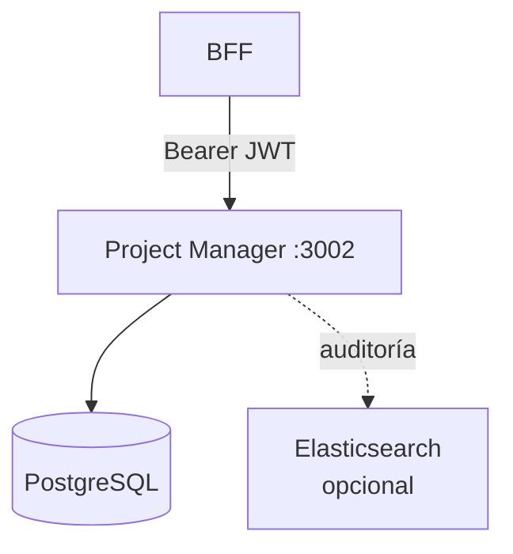
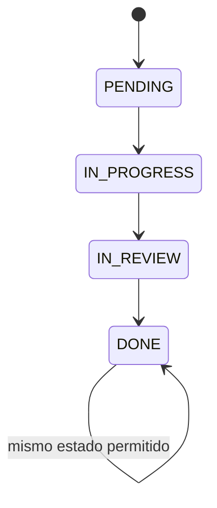
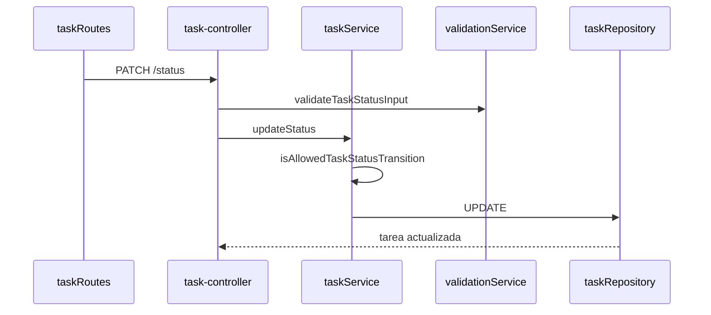

# Project Manager — Guía de estudio

Microservicio de **dominio**: proyectos, tareas, estados, disponibilidad de recursos y consultas para dashboard. Persistencia en PostgreSQL y autorización vía JWT (mismo secreto que Auth).

---

## Objetivos de aprendizaje

1. Modelar el ciclo de vida de una tarea (`PENDING` → `DONE`).
2. Seguir el flujo Controller → Service → Repository.
3. Entender validación de fechas y transiciones de estado.
4. Relacionar auditoría, métricas y circuit breaker con el núcleo CRUD.

---

## Posición en el sistema



Prefijo API interno: **`/api/v1`**

---

## Arquetipo y patrones

| Patrón | Ubicación | Rol |
|--------|-----------|-----|
| **Microservicio de dominio** | Servicio completo | Lógica de proyectos/tareas |
| **Repository** | `repositories/*.js` | Acceso SQL desacoplado |
| **Service layer** | `services/*.js` | Reglas de negocio y validación |
| **DTO** | `dtos/projectDto.js`, `taskDto.js` | Salida API estable |
| **Middleware** | `authMiddleware`, `roleMiddleware` | JWT + RBAC |
| **State machine (simplificada)** | `constants/taskStatuses.js` | Transiciones lineales |
| **Resource guard** | `ensureResourceAvailable` | Evitar operar si recurso no disponible |
| **Circuit Breaker** | `lib/circuitBreaker.js` | Resiliencia en clientes externos |
| **Auditoría** | `auditLog.js`, `elasticAuditClient.js` | Trazabilidad de operaciones |

---

## Modelo de estados de tarea



Solo se permite avanzar **un paso** (o mantener el estado). Implementación: `isAllowedTaskStatusTransition` en `src/constants/taskStatuses.js`.

| Estado | Significado |
|--------|-------------|
| `PENDING` | Pendiente |
| `IN_PROGRESS` | En ejecución |
| `IN_REVIEW` | En revisión |
| `DONE` | Finalizada |

---

## API principal (vía BFF o directo en dev)

Montaje en `gateway/apiGateway.js`:

| Recurso | Prefijo | Operaciones |
|---------|---------|-------------|
| Proyectos | `/projects` | CRUD |
| Tareas | `/tasks` | CRUD + `PATCH .../status` |
| Consultas | `/consultations` | Agregados dashboard |

**Roles típicos:**

- Crear/editar proyecto: `gestor`
- Operar tareas: según ruta (`gestor`, `profesional`)
- Consultas: según política en `roleMiddleware`

---

## Flujo interno (ejemplo: cambiar estado)



---

## Estructura de carpetas (orden de lectura)

```
ms-project-manager/src/
├── app.js
├── gateway/apiGateway.js
├── routes/
├── controllers/
├── services/
│   ├── projectService.js
│   ├── taskService.js
│   ├── validationService.js
│   └── consultationService.js
├── repositories/
├── dtos/
├── constants/taskStatuses.js
├── middlewares/
├── db/pool.js
└── metrics/prometheus.js
```

**Ruta sugerida:** `taskStatuses.js` → `validationService.js` → `taskService.js` → `taskRepository.js` → `taskRoutes.js`.

---

## Base de datos

Migraciones en `migrations/` (aplicar con `npm run db:migrate`).

Tablas principales: **PROJECT**, **TASK** (campos de fecha `fecha_inicio` / `fecha_termino` mapeados a `startDate` / `endDate` en API).

---

## Variables de entorno

| Variable | Uso |
|----------|-----|
| `PORT` | 3002 |
| `DATABASE_URL` | PostgreSQL |
| `JWT_SECRET` | Validar token emitido por Auth |
| `API_GATEWAY_PREFIX` | `/api/v1` |

---

## Testing

```bash
cd ms-project-manager
npm test
```

| Test | Qué valida |
|------|------------|
| `tests/taskStatuses.test.js` | Normalización y transiciones |
| `tests/validationService.test.js` | Proyectos, tareas, status |
| `tests/projectDto.test.js` | Mapeo de fechas y trim |
| `tests/errorHandler.test.js` | `ValidationError`, `NotFoundError` |

Sin conexión a BD: ideal para CI rápido.

---

## Observabilidad

| Recurso | Ruta / uso |
|---------|------------|
| Prometheus | `GET /metrics` |
| Logs operativos | Winston / consola |
| Auditoría | Eventos JSON → Elasticsearch (si está configurado) |

---

## Preguntas para autoevaluación

1. ¿Por qué la validación de transición está en el **service** y también en **constants**?
2. ¿Qué ventaja da el patrón Repository si mañana cambias de PostgreSQL?
3. ¿Por qué PM vuelve a validar JWT si el BFF ya lo hizo?
4. ¿Qué ocurre si intentas pasar de `PENDING` a `DONE` directamente?

---

## Referencias

- [README backend](../../README.md)
- [BFF README-ESTUDIO](../bff/README-ESTUDIO.md)
- [Auth README-ESTUDIO](../ms-auth/README-ESTUDIO.md)
