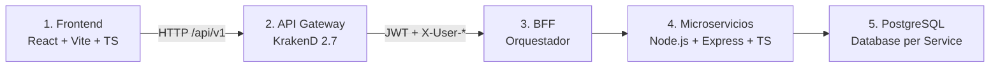

# InnovaTech Solutions — Plataforma Integral de Gestión de Proyectos

**InnovaTech** es una solución empresarial basada en **microservicios** para gestionar **equipos distribuidos**, **proyectos tecnológicos**, tareas, colaboración y analítica (KPIs). El sistema implementa autenticación JWT (RS256), control de acceso por roles (RBAC) y el patrón **Database per Service**, cumpliendo los requisitos técnicos de la evaluación EP3.

Este documento es la **guía central de revisión** para el profesor: arquitectura, stack, instalación, pruebas y estructura del repositorio.

---

## Arquitectura del sistema (5 capas)

El flujo de una petición sigue una separación estricta de responsabilidades:



| Capa | Componente | Puerto (local) | Responsabilidad |
|------|------------|----------------|-----------------|
| **1. Presentación** | Frontend (Vite / React / TypeScript) | `:5173` | UI: login, proyectos, tareas, KPIs, colaboración |
| **2. Gateway** | KrakenD | `:8010` | Entrada única, CORS, validación JWT, RBAC, propagación de identidad |
| **3. Orquestación** | BFF | `:3010` (interno) | Adapta respuestas al contrato del frontend; agrega llamadas |
| **4. Negocio** | ms-auth, ms-users, ms-project-manager, **ms-kpi** | internos | Autenticación, usuarios, proyectos/tareas, **KPIs y dashboard** |
| **5. Datos** | PostgreSQL (`users-db`, `pm-db`) | `:5433`, `:5434` | Persistencia independiente por microservicio |

**Entrada HTTP pública:** `http://localhost:8010/api/v1/`

---

## Stack tecnológico

| Área | Tecnologías |
|------|-------------|
| **Frontend** | React 18, Vite 5, TypeScript, React Router, Vitest |
| **Backend** | Node.js 20+, Express 4, **TypeScript**, **ES Modules (ESM)** en todos los servicios |
| **Gateway** | KrakenD 2.7 — JWT **RS256**, JWKS, propagación `X-User-Id`, `X-User-Email`, `X-User-Role` |
| **Persistencia** | PostgreSQL 16, **Flyway** (migraciones), patrón **Database per Service** |
| **Seguridad** | bcrypt, blacklist de tokens, RBAC (`gestor`, `profesional`, `directivo`) |
| **API Docs** | Swagger / OpenAPI (`/api-docs` en cada servicio) |
| **Contenedores** | Docker Compose (local), manifiestos **Kubernetes** (`backend/k8s/`) |
| **Observabilidad** | Prometheus (`/metrics`), logs Winston, auditoría en operaciones críticas |

---

## Guía de instalación rápida

### Requisitos

- Node.js 20+
- npm
- Docker Desktop
- Git

Guía detallada paso a paso: [INSTRUCCIONES-INICIO.md](INSTRUCCIONES-INICIO.md)

### 1. Backend (Docker Compose)

```powershell
cd backend\ms-auth
node .\scripts\generate-keys.js
cd ..

copy .env.docker.example .env.docker
docker compose --env-file .env.docker up -d --build
```

| Recurso | URL |
|---------|-----|
| API (KrakenD) | http://localhost:8010/api/v1/ |
| JWKS | http://localhost:8010/.well-known/jwks.json |
| Prometheus | http://localhost:9090 |

### 2. Frontend

```powershell
cd frontend
npm install
npm run dev
```

Abrir: http://localhost:5173

### 3. Credenciales de prueba

Contraseña para todos: **`Secret123`**

| Email | Rol |
|-------|-----|
| `gestor@innovatech.cl` | gestor |
| `profesional@innovatech.cl` | profesional |
| `directivo@innovatech.cl` | directivo |

### 4. Verificación E2E (opcional)

Con el backend levantado:

```powershell
cd backend
npm run smoke
```

---

## Calidad y testing

La rúbrica exige **≥ 60% de cobertura** en pruebas unitarias. El proyecto **supera ampliamente** ese umbral:

| Componente | Cobertura aprox. (líneas) | Herramienta |
|------------|---------------------------|-------------|
| Frontend | ~90% | Vitest + Testing Library |
| ms-auth | ~87% | Jest + Supertest |
| ms-users | ~92% | Jest + Supertest |
| ms-project-manager | ~91% | Jest + Supertest |
| ms-kpi | ≥60% | Jest + Supertest |
| BFF | ~91% | Jest + Supertest |

### Comandos

```powershell
# Backend (desde backend/)
npm test

# Frontend (desde frontend/)
npm test
npm run test:coverage
```

---

## Evolución técnica: migración a ES Modules

Todo el backend fue estandarizado con **`"type": "module"`** (ESM):

- Imports/exports nativos (`import` / `export`) en lugar de CommonJS (`require`).
- Alineación con Node.js 20+ y TypeScript moderno.
- Mejor tree-shaking, mantenibilidad y coherencia entre microservicios, BFF y scripts de utilidad (`backend/scripts/`).

Esta decisión reduce deuda técnica y facilita la evolución del monorepo hacia despliegues containerizados y CI/CD.

---

## Estructura del repositorio

El repositorio expone **tres carpetas principales**:

```
InnovaTech/
├── README.md                 ← Punto de entrada (enlaza a docs/)
├── backend/                  ← Microservicios, BFF, Gateway, Docker, K8s
│   ├── api-gateway/          KrakenD (krakend.json)
│   ├── bff/                  Backend for Frontend
│   ├── ms-auth/              Autenticación y JWT
│   ├── ms-users/             Usuarios y perfiles
│   ├── ms-project-manager/   Proyectos, tareas, colaboración
│   ├── ms-kpi/               KPIs y dashboard de progreso
│   ├── k8s/                  Manifiestos Kubernetes (Ingress, namespace)
│   ├── scripts/              Smoke E2E y utilidades de migración ESM
│   ├── docker-compose.yml
│   └── package.json          Scripts npm del monorepo backend
├── frontend/                 ← SPA React + TypeScript (Vite)
└── docs/                     ← Informes, diagramas, guía de inicio
    ├── README.md             ← Guía central (este archivo)
    ├── INSTRUCCIONES-INICIO.md
    ├── diagramas/            Fuentes C1 / C2 / C3
    ├── report.pdf            (entregable)
    ├── presentation.pdf      (entregable)
    └── caso-estudio.pdf      (entregable)
```

### Documentación por servicio

| Servicio | README |
|----------|--------|
| Backend general | [`backend/README.md`](../backend/README.md) |
| Frontend | [`frontend/README.md`](../frontend/README.md) |
| BFF | [`backend/bff/README.md`](../backend/bff/README.md) |
| ms-auth | [`backend/ms-auth/README.md`](../backend/ms-auth/README.md) |
| ms-users | [`backend/ms-users/README.md`](../backend/ms-users/README.md) |
| ms-project-manager | [`backend/ms-project-manager/README.md`](../backend/ms-project-manager/README.md) |
| ms-kpi | [`backend/ms-kpi/README.md`](../backend/ms-kpi/README.md) |
| API Gateway | [`backend/api-gateway/README.md`](../backend/api-gateway/README.md) |
| Kubernetes | [`backend/k8s/README.md`](../backend/k8s/README.md) |

---

## Flujo de trabajo Git

Desarrollo en ramas de feature y **Pull Requests hacia `main`**.

Repositorio: [senioravo/backend_innovatech](https://github.com/senioravo/backend_innovatech)

---

## Cumplimiento EP3 (resumen)

| Requisito | Estado |
|-----------|--------|
| Estructura `/backend`, `/frontend`, `/docs` | ✅ |
| Microservicios + BFF + Gateway + ms-kpi | ✅ |
| Database per Service + Flyway | ✅ |
| Frontend TypeScript | ✅ |
| Swagger por servicio | ✅ |
| Global Exception Handlers | ✅ |
| Cobertura tests ≥ 60% | ✅ |
| Docker Compose + Kubernetes | ✅ |
| README + tabla técnica por servicio | ✅ |
| Informe / presentación / diagramas PDF | 📄 En esta carpeta (`docs/`) |

---

**InnovaTech Solutions** — EP3 · Arquitectura de microservicios · InnovaTech
