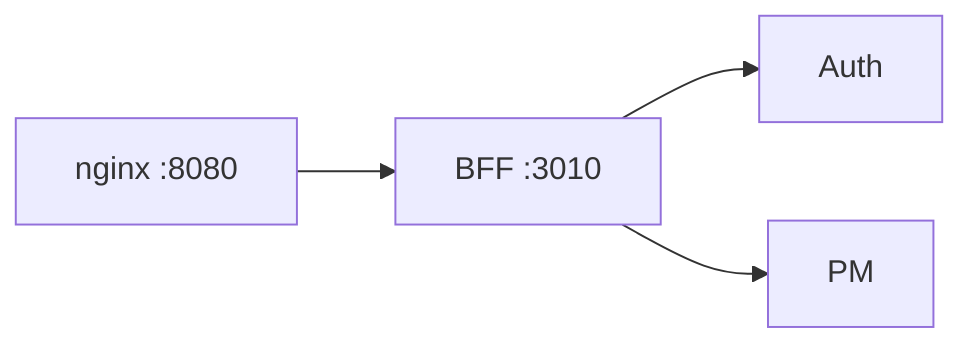
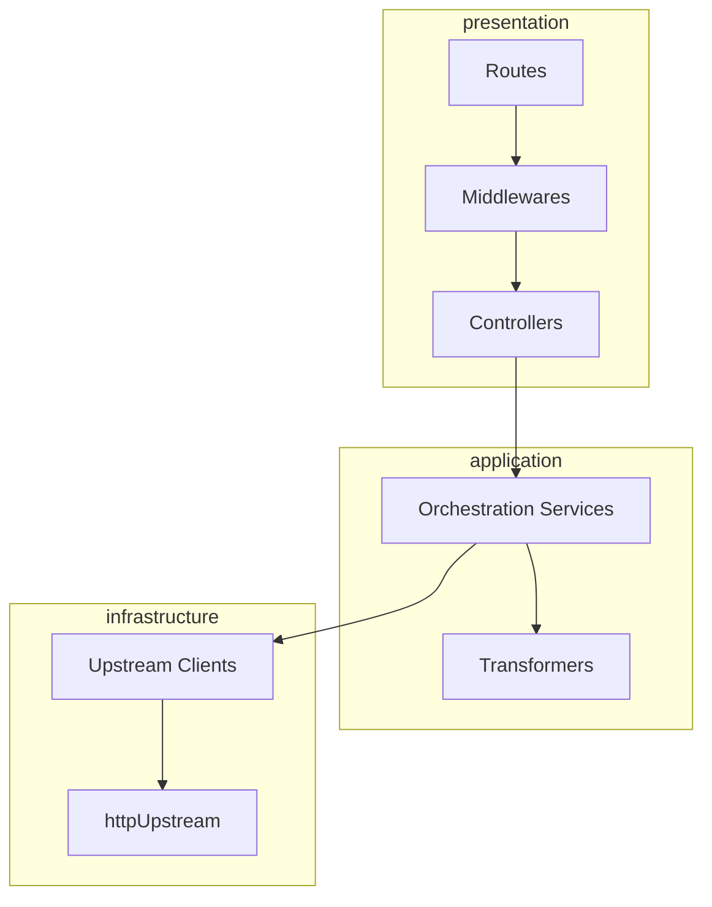
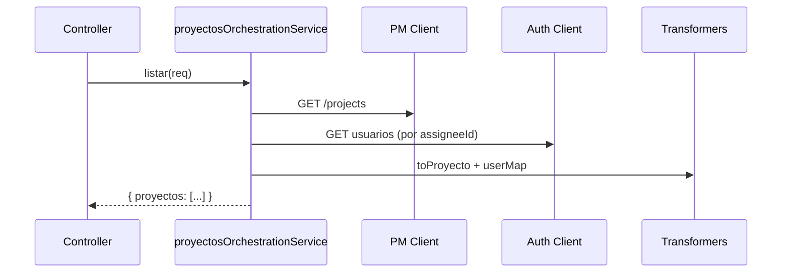

# BFF — Guía de estudio

**Backend for Frontend**: único punto de agregación para el cliente. Orquesta Auth y Project Manager, aplica autorización por rol y adapta respuestas al contrato del front (español, campos simplificados).

---

## Objetivos de aprendizaje

1. Diferenciar **reenvío** (proxy) de **orquestación** (varias llamadas + merge).
2. Describir las tres capas: `presentation`, `application`, `infrastructure`.
3. Explicar rutas públicas vs protegidas y el middleware JWT.
4. Localizar transformadores y clientes upstream.

---

## Posición en el sistema



Todo el tráfico del front entra como:

`http://localhost:8080/api/v1/...` → nginx → BFF.

---

## Arquetipo y patrones

| Patrón | Carpeta / archivo | Por qué aquí |
|--------|-------------------|--------------|
| **BFF** | Servicio completo | El front no consume PM/Auth directamente |
| **Capas limpias** | `presentation/`, `application/`, `infrastructure/` | Testabilidad y cambio de upstream |
| **Orquestación** | `proyectosOrchestrationService.js` | Combina proyectos + datos de usuario |
| **Adapter / Client** | `authUpstreamClient.js`, `projectManagerUpstreamClient.js` | HTTP hacia otros MS sin acoplar controllers |
| **Transformer** | `frontendResponseTransformers.js` | Mapeo `name` → `nombre`, resúmenes de tareas |
| **Middleware** | `jwtAuthMiddleware`, `requireRoleMiddleware` | Seguridad antes de llamar a PM |
| **Gateway router** | `presentation/http/gateway/apiGateway.js` | Composición modular de rutas |
| **UpstreamError** | `utils/errorHandler.js` | Propagar status/body de microservicios |

---

## Capas (arquitectura interna)



---

## Rutas expuestas (prefijo `/api/v1`)

### Sesión (front-friendly)

| Método | Ruta | Descripción |
|--------|------|-------------|
| POST | `/login` | Proxy a Auth login |
| POST | `/logout` | JWT requerido → Auth logout |

### Auth (orquestado)

| Prefijo | Ejemplos |
|---------|----------|
| `/auth` | `register`, `login`, `roles`, rutas protegidas |

### Agregados para el front

| Método | Ruta | Comportamiento |
|--------|------|----------------|
| GET | `/proyectos` | PM projects + enriquecimiento Auth |
| GET | `/proyectos/:id/tareas` | Tareas + resumen por estado |

### Reenvío Project Manager (con JWT + rol)

| Prefijo | Recurso |
|---------|---------|
| `/projects` | CRUD proyectos |
| `/tasks` | Tareas (rutas anidadas según PM) |
| `/consultations` | Dashboard / consultas |

---

## Flujo orquestado: GET /proyectos



---

## Estructura de carpetas (orden de lectura)

```
services/bff/src/
├── app.js
├── config/index.js
├── presentation/http/
│   ├── gateway/apiGateway.js
│   ├── routes/
│   │   ├── publicSessionRoutes.js
│   │   ├── frontendProyectosRoutes.js
│   │   └── protectedProjectManagerRoutes.js
│   ├── controllers/
│   └── middlewares/
│       ├── jwtAuthMiddleware.js
│       └── requireRoleMiddleware.js
├── application/
│   ├── auth/authOrchestrationService.js
│   ├── proyectos/proyectosOrchestrationService.js
│   └── transformers/frontendResponseTransformers.js
└── infrastructure/
    ├── clients/
    └── http/httpUpstream.js
```

**Ruta sugerida:** `apiGateway.js` → `publicSessionRoutes.js` → `jwtAuthMiddleware.js` → `proyectosOrchestrationService.js` → `frontendResponseTransformers.js`.

---

## Variables de entorno

| Variable | Uso |
|----------|-----|
| `PORT` | 3010 |
| `JWT_SECRET` | Validar Bearer (mismo que Auth) |
| `AUTH_SERVICE_BASE_URL` | p. ej. `http://auth:3001` |
| `PROJECT_MANAGER_BASE_URL` | p. ej. `http://project-manager:3002` |
| `API_GATEWAY_PREFIX` | `/api/v1` |

---

## Testing

```bash
cd services/bff
npm test
```

| Test | Archivo |
|------|---------|
| Transformación al español | `tests/frontendResponseTransformers.test.js` |
| Roles 403/200 | `tests/requireRoleMiddleware.test.js` |
| URLs upstream | `tests/httpUpstream.test.js` |
| Errores | `tests/errorHandler.test.js` |

Tests **sin red**: lógica pura y middleware mockeado.

---

## Preguntas para autoevaluación

1. ¿Por qué `/login` está en la raíz del API y no solo bajo `/auth`?
2. ¿Qué ventaja tiene `UpstreamError` frente a un `throw` genérico?
3. ¿En qué capa debe vivir una nueva regla de negocio que combine dos microservicios?
4. ¿Qué pasa si el BFF no validara roles y solo reenviara el JWT a PM?

---

## Referencias

- [README backend](../../README.md)
- [Auth README-ESTUDIO](../auth/README-ESTUDIO.md)
- [PM README-ESTUDIO](../project-manager/README-ESTUDIO.md)
